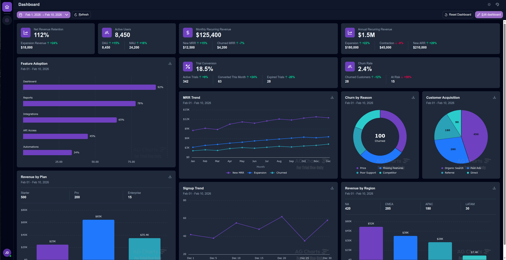
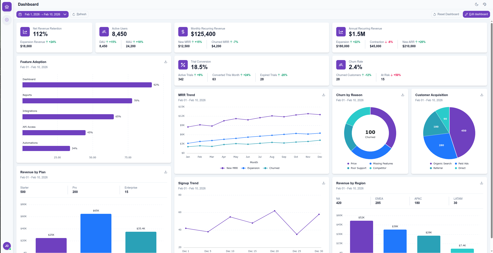

# Vue Dashboard Demo

A modern, responsive dashboard application built with Vue 3, featuring drag-and-drop widgets, interactive charts, and a
customizable layout system. Built as a portfolio demonstration of SaaS dashboard patterns.

## Screenshots

### Dark mode



### Light mode



**Live Demo:** [https://veco9.github.io/vue-dashboard-demo/](https://veco9.github.io/vue-dashboard-demo/)

## Tech Stack

| Technology           | Purpose                        |
|----------------------|--------------------------------|
| Vue 3                | UI framework (Composition API) |
| TypeScript 5         | Type safety                    |
| Vite 7               | Build tooling                  |
| Tailwind CSS 4       | Styling                        |
| PrimeVue 4           | UI components                  |
| AG Charts Enterprise | Charting library               |
| grid-layout-plus     | Responsive grid system         |
| VueUse               | Composable utilities           |
| vue-i18n             | Internationalization           |
| dayjs                | Date handling                  |

## Features

- **Responsive Grid Layout** — Widgets adapt across 5 breakpoints (desktop → mobile)
- **Drag and Drop** — Add, remove, and rearrange widgets from an edit-mode palette
- **Interactive Charts** — Bar, line, pie, donut, and horizontal bar charts (AG Charts)
- **KPI Cards** — Key metrics with growth indicators and comparison values
- **Period Filter** — Global date selector with quick presets (Today, Last 7 days, YTD, etc.)
- **Chart Export** — Download any chart as PNG
- **Layout Persistence** — Dashboard state saved to localStorage
- **Keyboard Shortcuts** — `E` toggle edit mode, `R` refresh, `Escape` exit edit mode
- **Loading & Error States** — Simulated via toolbar buttons in edit mode to demonstrate production-ready UX patterns

## Quick Start

```bash
npm install
npm run dev
```

## Deployment

Deployed to GitHub Pages via GitHub Actions on every push to `main`.

To enable for a fork: **Settings** → **Pages** → set Source to **GitHub Actions**.

## Architecture

See [docs/ARCHITECTURE.md](docs/ARCHITECTURE.md) for the widget factory pattern, state management,
component hierarchy, responsive grid system, and full project structure.

## License

MIT
