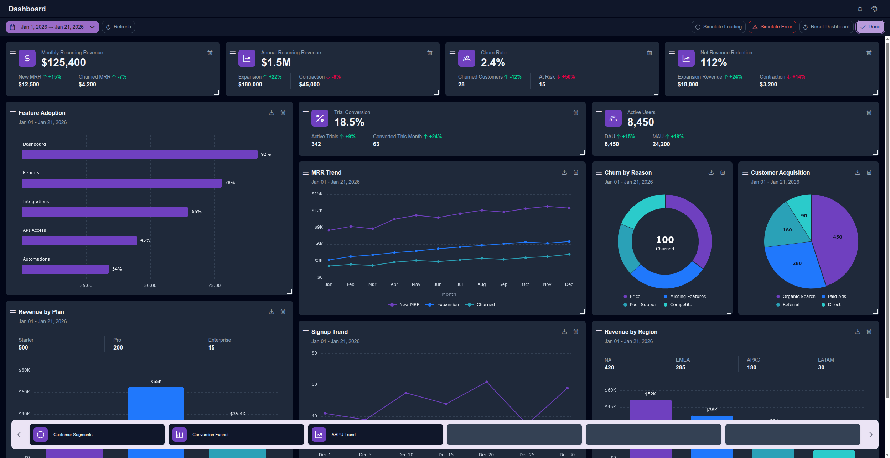
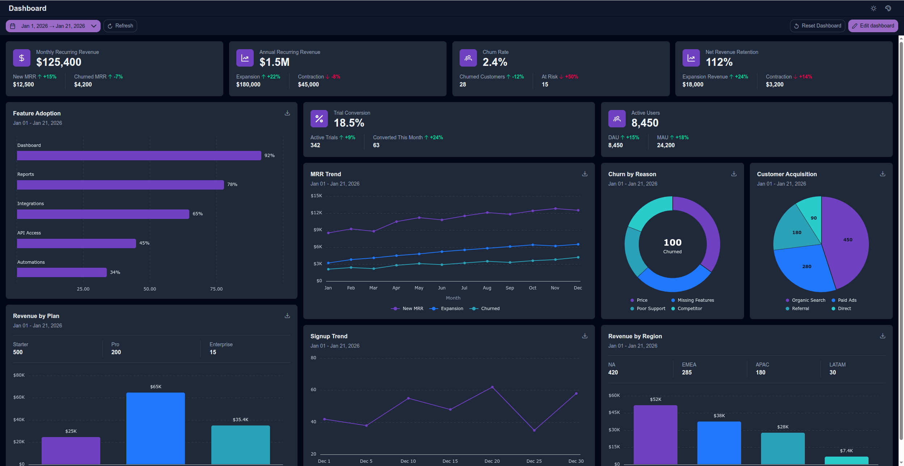

# Vue Dashboard Demo

A modern, responsive dashboard application built with Vue 3, featuring drag-and-drop widgets, interactive charts, and a
customizable layout system. Built as a portfolio demonstration of SaaS dashboard patterns.

## Dashboard Screenshot

### Initial



### Edit mode



## Features

### Core Functionality

- **Responsive Grid Layout** - Widgets automatically adapt to screen size with breakpoint-specific configurations
- **Drag and Drop** - Intuitive widget management with drag from palette to dashboard
- **Interactive Charts** - Bar, line, pie, and donut charts powered by AG Charts Enterprise
- **KPI Cards** - Display key metrics with growth indicators and comparison values
- **Edit Mode** - Toggle edit mode to add, remove, or rearrange widgets
- **Period Filter** - Global date period selector with year-over-year comparison support
- **Quick Date Presets** - One-click presets: Today, Yesterday, Last 7 days, This week, This month, YTD, etc.
- **Chart Export** - Download any chart widget as PNG image

### User Experience

- **Keyboard Shortcuts** - `E` to toggle edit mode, `R` to refresh, `Escape` to exit edit mode
- **Layout Persistence** - Dashboard layout automatically saved to localStorage
- **Smooth Transitions** - Vue transitions for widget state changes
- **Loading & Error States** - Visual feedback during data fetching with animated loaders and error recovery UI

### Demo Features

In edit mode, the toolbar exposes **Simulate Loading** and **Simulate Error** buttons. Since mock data loads instantly
and never fails, these buttons let you demonstrate the widget wrapper's loading spinners and error handling states -
showcasing production-ready UX patterns that would otherwise be invisible in a demo environment.

## Quick Start

```bash
# Install dependencies
npm install

# Start development server
npm run dev

# Build for production
npm run build

# Preview production build
npm run preview
```

## Deployment

The application is deployed to GitHub Pages via GitHub Actions. Every push to `main` triggers an automatic build and deployment.

**Live Demo:** [https://veco9.github.io/vue-dashboard-demo/](https://veco9.github.io/vue-dashboard-demo/)

To enable deployment for a fork:
1. Go to repository **Settings** → **Pages**
2. Under **Build and deployment**, set Source to **GitHub Actions**
3. Push to `main` to trigger the deployment workflow

## Project Structure

```
src/
├── components/
│   ├── dashboard/               # Dashboard orchestration
│   │   ├── DashboardView.vue    # Main container & state management
│   │   ├── DashboardToolbar.vue # Period selector, edit toggle
│   │   ├── DashboardPalette.vue # Widget palette (edit mode)
│   │   ├── DashboardHeader.vue
│   │   └── DashboardEmptyState.vue
│   ├── widgets/                 # Widget components
│   │   ├── WidgetChart.vue      # Chart widget container
│   │   ├── WidgetKpi.vue        # KPI widget container
│   │   ├── WidgetWrapper.vue    # Loading/error states shell
│   │   ├── WidgetHeader.vue
│   │   ├── WidgetPlaceholder.vue
│   │   ├── AgChart.vue          # AG Charts renderer
│   │   ├── KpiCard.vue
│   │   └── DonutChart.vue
│   └── ThemeSwitcher.vue        # Theme toggle component
├── composables/
│   ├── useGridLayout.ts         # Grid calculations & breakpoints
│   ├── useGridDragDrop.ts       # Drag and drop logic
│   ├── useWidgetManager.ts      # Widget state & initialization
│   ├── useDragHandle.ts         # Drag handle behavior
│   ├── useLayoutPersistence.ts  # localStorage persistence
│   ├── useKeyboardShortcuts.ts  # Keyboard shortcut handlers
│   ├── useDemoFeatures.ts       # Demo simulation controls
│   └── theme/                   # Theme management
│       ├── useTheme.ts          # Theme composable
│       ├── palettes.ts          # Color palette definitions
│       ├── storage.ts           # Theme persistence
│       └── types.ts             # Theme type definitions
├── models/                      # TypeScript interfaces
│   ├── dashboardWidget.ts       # Widget types & interfaces
│   ├── layoutItem.ts            # Grid layout types
│   └── datePresets.ts           # Date range preset definitions
├── mock/
│   ├── mockWidgets.ts           # Widget collection & registration
│   ├── mockData.ts              # Data simulation utilities
│   └── widgetItems/
│       ├── hr/                  # HR dashboard widgets
│       │   ├── palette/         # Palette-only widgets
│       │   └── *.ts             # Widget factory functions
│       └── saas/                # SaaS metrics widgets
│           └── *.ts             # Widget factory functions
├── plugins/
│   └── i18n.ts                  # vue-i18n configuration
├── utils/
│   ├── barChartTransform.ts     # Bar chart data transforms
│   ├── lineChartTransform.ts    # Line chart data transforms
│   ├── chartHelpers.ts          # Shared chart utilities
│   ├── chartTheme.ts            # AG Charts theme config
│   ├── computeWidgetPositions.ts # Bin-packing algorithm
│   ├── layoutUtils.ts           # Layout calculation helpers
│   └── formatters.ts            # Number & date formatters
├── locales/
│   └── en.json                  # English translations
├── App.vue                      # Root component
└── main.ts                      # Application entry point
```

## Architecture

### Widget Factory Pattern

Widgets are defined as `DashboardWidget` objects that encapsulate configuration and data fetching:

```typescript
import type { DashboardWidget, InitParams } from "@/models/dashboardWidget";

export function getMyWidget(id: number): DashboardWidget {
  return {
    layout: {x: 0, y: 0, w: 4, h: 8, i: id, minW: 2, minH: 6},
    type: "bar",
    displayName: "My Widget",
    initialize: async ({period, params, callbacks}: InitParams) => {
      const data = await fetchData(period);

      return {
        header: {
          title: "My Widget",
          subtitleItems: [{label: "2024"}],
        },
        data: {
          type: "bar",
          data: transformedData,
          series: chartSeries,
        },
      };
    },
  };
}
```

### State Management

State is managed through composables composed into `DashboardView`:

- **useGridLayout** - Grid calculations, breakpoint handling, responsive layout caching
- **useWidgetManager** - Widget loading states, runtime state tracking, `initialize()` orchestration
- **useGridDragDrop** - Drag events, grid coordinate calculation, palette ↔ dashboard transfers
- **useLayoutPersistence** - Save/restore layout from localStorage

### Data Flow

1. `DashboardView` holds root state: `widgetItems`, `paletteWidgets`, `globalPeriod`, `editModeActive`
2. Period changes trigger `watch(globalPeriod)` → `initializeWidgets()` for all widgets
3. Drag-drop from palette adds widget to dashboard and calls its `initialize()`
4. Widget components receive data through `useWidgetManager` accessors

## Widget Types

| Type            | Description                   | Component     |
|-----------------|-------------------------------|---------------|
| `bar`           | Vertical bar chart            | `WidgetChart` |
| `horizontalBar` | Horizontal bar chart          | `WidgetChart` |
| `line`          | Line/area chart               | `WidgetChart` |
| `pie`           | Pie chart                     | `WidgetChart` |
| `donut`         | Donut chart with center label | `WidgetChart` |
| `kpi`           | Key performance indicators    | `WidgetKpi`   |

## Tech Stack

| Technology           | Purpose                        |
|----------------------|--------------------------------|
| Vue 3                | UI framework (Composition API) |
| TypeScript 5         | Type safety                    |
| Vite 7               | Build tooling                  |
| Tailwind CSS 4       | Styling                        |
| PrimeVue 4           | UI components                  |
| AG Charts Enterprise | Charting library               |
| grid-layout-plus     | Responsive grid system         |
| VueUse               | Composable utilities           |
| vue-i18n             | Internationalization           |
| dayjs                | Date handling                  |

## Keyboard Shortcuts

| Key      | Action              |
|----------|---------------------|
| `E`      | Toggle edit mode    |
| `R`      | Refresh all widgets |
| `Escape` | Exit edit mode      |

## Potential Enhancements

Features commonly found in production BI dashboards that could extend this demo:

| Feature           | Description                                                     |
|-------------------|-----------------------------------------------------------------|
| Global Filters    | Filter panel for dimensions beyond date (region, segment, etc.) |
| Drill-down        | Click chart elements to see detailed breakdowns                 |
| Widget Fullscreen | Expand individual widgets to full viewport                      |
| Cross-filtering   | Clicking one widget filters others                              |
| Dashboard Tabs    | Multiple dashboard pages with navigation                        |
| Auto-refresh      | Configurable refresh intervals                                  |
| Annotations       | Add notes to specific data points or time periods               |
| Alerts            | Visual indicators when metrics exceed thresholds                |
| Undo/Redo         | Revert layout changes in edit mode                              |
| Theme Toggle      | Dark/light mode switching                                       |

## License

MIT
